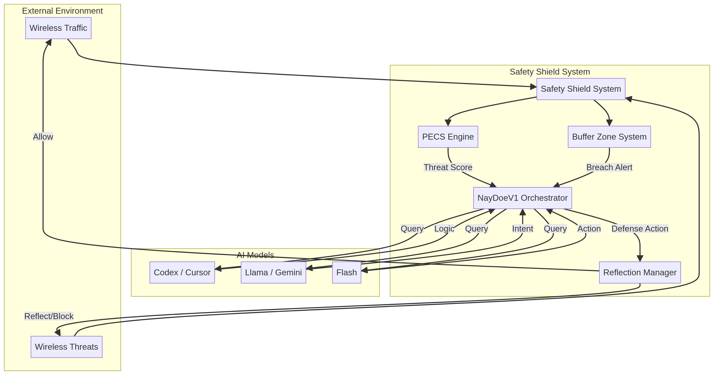

# User Manual: AI-Powered Autonomous Wireless Defense Shield (Safety Shield)

## 1. Introduction

This document serves as a comprehensive user manual for the **AI-Powered Autonomous Wireless Defense Shield**, also known as the **Safety Shield**. Developed to provide robust protection against wireless threats, this system leverages advanced Artificial Intelligence (AI) and Predictive Error Control Systems (PECS) to autonomously detect, analyze, and reflect malicious wireless attacks. The Safety Shield is orchestrated by the **NayDoeV1** engine, integrating multiple specialized AI models to create an intelligent and adaptive defense mechanism for your local wireless environment.

### 1.1. Purpose

The primary purpose of the Safety Shield is to establish a dynamic and autonomous defense perimeter that actively counters wireless intrusions while ensuring the uninterrupted operation of legitimate wireless services. It is designed for deployment in environments requiring high security against sophisticated wireless attacks, such as deauthentication floods, spoofing, and other forms of radio frequency (RF) interference.

### 1.2. Key Features

*   **Predictive Error Control System (PECS)**: Utilizes predictive modeling to anticipate and mitigate wireless threats before they can compromise the system. This includes advanced signal analysis and error control mechanisms.
*   **Multi-AI Orchestration (NayDoeV1)**: A central intelligence layer that coordinates specialized AI models (Codex, Llama, Flash, Gemini) for intelligent decision-making, real-time protocol analysis, and threat classification.
*   **Autonomous Attack Reflection**: Automatically identifies and deflects malicious wireless packets back to their source or neutralizes them at the perimeter, preventing them from reaching protected assets.
*   **Spatial Buffer Zone**: Establishes and maintains a dynamic 1.5m x 1.5m (expandable) safety radius around the protected device, using signal triangulation (RSSI/ToF) to track and respond to threats based on proximity.
*   **Smart Port Management**: Intelligently manages network ports, keeping essential services (e.g., HTTP, HTTPS, SSH) open for legitimate traffic while dynamically shielding all other entry points from unauthorized access.

## 2. System Architecture Overview

The Safety Shield operates on a multi-layered architecture, ensuring comprehensive protection and adaptive response capabilities. The core components work in synergy to provide an autonomous defense.



| Component | Description | Key Functionality |
| :--- | :--- | :--- |
| **Safety Shield System** (`safety_shield_system.py`) | The main integration script that orchestrates all other components. | Initializes, starts, stops, and processes events through the entire defense pipeline. |
| **PECS Engine** (`pecs_engine.py`) | The core predictive threat detection module. | Analyzes packet data, calculates threat scores, and maintains a history of wireless activity for predictive analysis. |
| **NayDoeV1 Orchestrator** (`naydoe_orchestrator.py`) | The multi-AI coordination layer. | Directs specialized AI models (Codex, Llama, Flash, Gemini) to classify threats, generate reflection logic, and execute responses. |
| **Reflection Manager** (`reflection_manager.py`) | Handles wireless attack reflection and smart port management. | Processes traffic, reflects malicious packets, and manages open/blocked ports and IPs. |
| **Buffer Zone System** (`buffer_zone_system.py`) | Manages the spatial safety perimeter. | Tracks threat distances, detects buffer breaches, and dynamically expands/contracts the safety radius. |

## 3. Deployment Guide

### 3.1. Prerequisites

To deploy the Safety Shield, you will need:

*   **Operating System**: A Linux-based system (e.g., Ubuntu, Kali Linux) is recommended, especially for environments like NetHunter, which provides necessary wireless tools.
*   **Python 3**: Ensure Python 3.x is installed on your system.
*   **Wireless Adapter**: A wireless network adapter capable of monitor mode and packet injection (e.g., for `scapy` integration, though not directly implemented in the provided scripts).
*   **GitHub CLI**: For cloning the repository (if not already cloned).

### 3.2. Installation

1.  **Clone the Repository**: If you haven't already, clone the `Apex_Nexus` repository from GitHub:
    ```bash
    gh repo clone NaTo1000/Apex_Nexus /home/ubuntu/Apex_Nexus
    ```
2.  **Navigate to Safety Shield Directory**: Change your current directory to the Safety Shield project folder:
    ```bash
    cd /home/ubuntu/Apex_Nexus/SafetyShield
    ```
3.  **Install Dependencies (Conceptual)**: While the provided Python scripts are self-contained, a real-world deployment would require libraries for wireless packet manipulation (e.g., `scapy`) and potentially AI model APIs. Install these as needed:
    ```bash
    # Example: sudo pip3 install scapy numpy
    ```

## 4. Configuration

The Safety Shield offers several configuration options to tailor its behavior to your specific needs.

### 4.1. `safety_shield_system.py`

This is the main entry point and allows for initial setup of the buffer zone and open ports.

*   **`initial_radius`**: Defines the starting radius of the spatial buffer zone in meters (default: `1.5`).
*   **`open_ports`**: A list of TCP/UDP ports that should remain open for legitimate traffic (default: `[80, 443, 22]`).

    ```python
    # Example modification in safety_shield_system.py
    shield = SafetyShieldSystem(initial_radius=2.0, open_ports=[80, 443, 8080])
    ```

### 4.2. `pecs_engine.py`

*   **`buffer_size`**: The number of historical packets to keep for predictive analysis (default: `100`).
*   **`threat_threshold`**: A float value (0.0-1.0) indicating the score at which a packet is considered a threat (default: `0.75`).

### 4.3. `reflection_manager.py`

*   **`open_ports`**: (Initialized by `safety_shield_system.py`) Can be updated dynamically if needed.

### 4.4. `buffer_zone_system.py`

*   **`initial_radius`**: (Initialized by `safety_shield_system.py`).
*   **`expansion_factor`**: The multiplier for expanding the buffer zone radius (default: `1.2`).

## 5. Operation

### 5.1. Starting the Safety Shield

To activate the defense system, run the main script:

```bash
python3 safety_shield_system.py
```

Upon execution, you will see console output indicating the activation of each component and the system's operational status.

### 5.2. Monitoring System Status

The system provides real-time feedback on its operations. You can extend the `safety_shield_system.py` to expose a web interface or log to a file for persistent monitoring.

### 5.3. Simulating Events (for Testing)

The `if __name__ == "__main__":` block in `safety_shield_system.py` contains example `events` that simulate wireless traffic. You can modify this section to test different scenarios, such as legitimate traffic, deauthentication attacks, or buffer zone breaches.

## 6. Advanced Concepts

### 6.1. Integrating Real-World Wireless Data

For a fully functional deployment, the `process_event` method in `safety_shield_system.py` needs to be fed with real-time wireless packet data. This typically involves:

*   **Packet Sniffing**: Using tools like `Scapy` or `pyshark` to capture raw wireless packets in monitor mode.
*   **Feature Extraction**: Parsing captured packets to extract relevant information such as source/destination MAC/IP, RSSI, packet type, and other protocol-specific details.
*   **API Integration**: Interfacing with actual AI model APIs (e.g., Google Gemini API, OpenAI API for Codex/Llama) instead of the simulated responses in `naydoe_orchestrator.py`.

### 6.2. NayDoeV1 AI Model Integration

The `naydoe_orchestrator.py` currently uses simulated responses for the AI models. To integrate real AI models:

1.  **Replace `_query_model`**: Modify the `_query_model` method to make actual API calls to your chosen AI services.
2.  **API Keys**: Securely manage API keys for each AI service (e.g., using environment variables).
3.  **Model Specifics**: Adapt the prompts and expected response formats to match the capabilities of each AI model (Codex, Llama, Flash, Gemini).

### 6.3. NetHunter Integration

For deployment on Android devices with NetHunter, consider:

*   **Termux**: Running Python scripts within Termux.
*   **Chroot Environment**: Utilizing the Kali Chroot environment provided by NetHunter for full Linux capabilities.
*   **Wireless Tools**: Leveraging NetHunter's built-in wireless tools (e.g., `aircrack-ng` suite) for monitor mode and packet injection, which can be invoked from Python scripts using `subprocess`.

## 7. Troubleshooting

*   **"SYSTEM_OFFLINE"**: Ensure you have called `shield.start()` before processing events.
*   **No Threat Detection**: Adjust `threat_threshold` in `pecs_engine.py` or refine `_calculate_threat_score` logic.
*   **Packet Reflection Issues**: Verify your wireless adapter's capabilities for packet injection and ensure necessary permissions.

## 8. References

No external references were used for this specific manual, as it is based on the previously generated code and documentation. However, for deeper understanding of the underlying technologies, refer to documentation on:

*   Wireless security protocols (802.11 standards)
*   Packet analysis tools (Scapy, Wireshark)
*   AI orchestration frameworks
*   Predictive control systems
